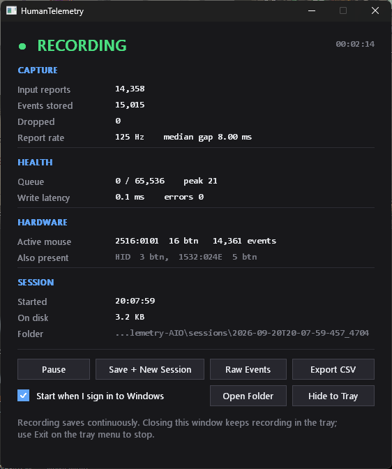
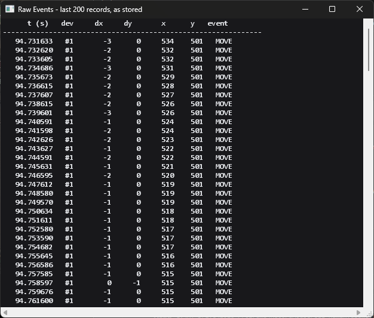

# RecordMouseFULL-HumanTelemetry-AIO

**HumanTelemetry** — a high-fidelity recorder for one person's mouse behaviour.

It captures the physical motor signal — what your hand actually did — at device
resolution, and stores it in a form that stays interpretable years later.

This program only **captures, stores and organises**. Analysis, feature
extraction and behavioural modelling are deliberately out of scope; they belong
to a separate program that reads this one's output.

**Status: recorder complete.** Runs in the tray, records continuously, survives
crashes, and reports data loss honestly.



**Raw Events** shows the last 200 records exactly as stored, so you can confirm
the dataset is what it claims to be rather than trusting a summary counter:



The rows above are a real target acquisition: `dx` decaying 5, 4, 3, 2, 1 as the
hand decelerates onto the target, then `LEFT_DOWN`, then `LEFT_UP` 92 ms later.
That deceleration profile and click dwell is the behavioural signal this whole
project exists to capture.

---

## Why this is not another mouse recorder

Every comparable open-source project (`generative-mouse-trajectories`,
`HumanMoveMouse`, `HumanMouse`, and the various AHK/PyAutoGUI recorders)
records **cursor coordinates** via window events or input hooks. That is the
signal *after* Windows has already transformed it.

HumanTelemetry records three layers instead of one:

| Layer | What it is | Who else records it |
|---|---|---|
| `raw_dx` / `raw_dy` | Sensor counts straight off the device, pre-acceleration | nobody |
| `cursor_x` / `cursor_y` | Resulting pixels, post-acceleration, post-clip | everybody |
| Ballistics config | The transform between them, snapshot per session | nobody |

Windows pointer acceleration is a non-linear function of your sensitivity
slider, the "Enhance pointer precision" setting and two registry curves.
Without it, a cursor-only dataset silently encodes the machine it was recorded
on and stops being valid the moment any of that changes.

---

## Install / run

Build or download `HumanTelemetry.exe` and run it. It opens a window, starts
recording immediately, and keeps recording when you close the window (it hides
to the tray — use **Exit** on the tray menu to actually stop).

Tick **Start when I sign in to Windows** to have it launch at logon.

### Where data goes

```
%LOCALAPPDATA%\RecordMouseFULL-HumanTelemetry-AIO\sessions\<session-id>\
├── session.json        devices, monitors, ballistics, OS, health counters
├── events-0000.mpseg   compressed raw events, append-only
└── context.jsonl       foreground/device/display/power/health timeline
```

Local disk, never the project folder or a synced drive: at 125 Hz this writes
~116 MB/day, at 1 kHz roughly eight times that, and a cloud-synced directory
would re-upload it continuously.

---

## Build

Requires the MSVC toolchain (Desktop development with C++).

```powershell
.\build.ps1 -Release
```

`build.ps1` exists because plain `cargo build` fails on some machines for two
reasons that both disguise themselves as compile errors:

- MSVC `link.exe` is not on `PATH` unless you are in a Developer shell. If
  Visual Studio is an Insiders/prerelease install, even `vswhere` cannot find
  it without `-prerelease`.
- From Git Bash, Git's GNU coreutils `link` shadows MSVC's `link.exe`, and the
  failure reads `link: extra operand …`, which looks like broken code.

The script locates `vcvars64.bat` itself and handles both. Build artifacts are
redirected to local disk by `.cargo/config.toml`.

---

## Command line

The GUI is the normal way in; these exist for scripting and diagnostics.

```
HumanTelemetry.exe list                # every session recorded
HumanTelemetry.exe verify              # read the bytes back, check the header
HumanTelemetry.exe export              # flatten a session to CSV
HumanTelemetry.exe info                # devices, monitors, ballistics
HumanTelemetry.exe startup on|off      # sign-in registration
HumanTelemetry.exe record --duration 28800   # headless fixed-length capture
```

| Option | Meaning |
|---|---|
| `--data <DIR>` | Data root |
| `--titles` | Also record foreground window titles (off by default) |
| `--tray` | Start hidden in the tray |
| `--out <FILE>` | Output path for `export` |

---

## Architecture

```
       physical mouse
             |
      Windows Raw Input          RIDEV_INPUTSINK: records while unfocused
             |
    capture thread (TIME_CRITICAL)
      stamp QPC -> decode -> push          <-- no allocation, no lock, no I/O
             |
     lock-free SPSC ring (65536)           <-- ~65 s of headroom at 1 kHz
             |
        writer thread
      zstd frames -> .mpseg                <-- allowed to block
      context -> .jsonl
             |
      immutable raw archive
```

The capture thread does four things and returns. Everything expensive —
compression, disk, resolving window handles to process names — happens on the
writer, where a stall costs nothing.

---

## Design decisions worth knowing

**Context is sideband, not per-event.** Monitor, foreground process and
modifier state are recorded when they *change*, on the same QPC clock, and
re-joined by timestamp interval during analysis. Putting them on every event
would mean several syscalls inside the `WM_INPUT` handler at 1 kHz.

**Modifiers are sampled at clicks only.** Four `GetAsyncKeyState` calls per
click, not per movement. Reading them through a keyboard hook was rejected
outright — that is a keylogger surface, and this program must never become one.

**`dx`/`dy` are `i32`, not `i16`.** A 25600-DPI sensor flicked hard on a 125 Hz
connection reports ~40000 counts in one report. `i16` would overflow and corrupt
exactly the fastest movements, which are the most personally characteristic
ones.

**Independent zstd frames, not one stream.** A streaming encoder compresses
slightly better and loses everything after the last flush on a power cut. Each
frame here is self-contained, so a torn tail costs one frame — a fraction of a
second — and everything before it still decodes.

**Append-only log, not SQLite, for raw events.** 1 kHz is ~86M events/day.
SQLite is right for sessions and derived features and wrong for an immutable
firehose. It belongs in the analysis program, not here.

**Native Win32 UI, not egui.** This process runs for weeks. An immediate-mode
GUI repaints continuously and holds a GPU surface to do it; these controls
repaint only on change, and the refresh timer stops entirely while hidden.

**Data loss is never hidden.** Dropped counts go in the session header *and*
get sampled into the context timeline every 30 s, so a loss is visible at the
moment it happened, not just as a total at the end.

**Startup falls back gracefully.** A logon scheduled task is preferred (it can
restart a crashed recorder) but needs elevation; unelevated it falls back to
the `HKCU\...\Run` key and tells you which one is in force.

---

## Verifying the data is real

Counters can lie by construction, so there are two ways to check the actual
bytes:

- **View Raw Events** in the window shows the last 200 records exactly as
  stored — timestamps, device, raw deltas, cursor position, event type.
- `HumanTelemetry.exe verify` re-reads every segment from disk, decompresses
  it, checks the count against the header and asserts timestamps are monotonic.

### Reading the counters

These are deliberately separate numbers, and they are not meant to match:

| Counter | Meaning |
|---|---|
| Input reports | `WM_INPUT` reports received from devices |
| Events written | Records stored. One report can yield several (move + button + wheel), and `SYNC` anchors have no report behind them |
| Dropped | Events lost because the ring was full. Should be 0 |
| Queue depth | Current / capacity, plus the high-water mark |
| Report rate | Measured, not advertised: current, peak, and average while moving |

---

## Durability

Recording runs for weeks, so the question is not "does it save" but "how much
can a power cut take with it". Three layers, cheapest first:

| Layer | Interval | Protects against |
|---|---|---|
| Compressed frame written + flushed | ~1 s | The process dying |
| `sync_all` forced to the physical disk | 60 s | The **machine** dying (power cut) |
| Session rolled over on the local clock hour | 1 h | Bounding any single session |

The distinction that matters: a flush only hands bytes to the Windows cache, and
an abrupt power cut loses whatever the OS had not written back — potentially
tens of seconds. `sync_all` is the real barrier, and once a minute costs one
fsync on a file measured in kilobytes.

Frames are independently compressed, so a torn tail costs one frame, not the
file. A session that never recorded a clean shutdown is *marked* interrupted on
the next run, never repaired or deleted.

---

## What each session records about itself

Beyond the events, every `session.json` is self-describing, so a dataset copied
off this machine years from now still means something:

| Group | Fields |
|---|---|
| **When** | UTC and **local** start/end, UTC offset, timezone name, weekday, local hour, day part (morning/afternoon/evening/night/late_night) |
| **Where** | Computer name, user name, machine GUID, true Windows version |
| **Hardware** | Every mouse: device path, VID/PID, buttons, driver-reported rate |
| **Display** | Every monitor: bounds, work area, DPI, scaling, primary |
| **Ballistics** | Pointer speed, Enhance Pointer Precision, both SmoothMouse curves |
| **Health** | Reports received, events written, dropped, peak queue, write latency, writer errors, clean/interrupted |

Local time is stored alongside UTC on purpose. "Does this person move
differently at 2am" is a first-class question for this dataset, and UTC alone
cannot answer it without knowing where the machine was. `machine_guid` is the
stable machine identity — a computer name can be changed, the GUID cannot — so
desktop and laptop data never silently pool together.

The Windows version is read from the registry rather than `GetVersion`, which
has been shimmed since Windows 8.1 and reports "6.2.9200" to any process without
a compatibility manifest.

---

## Honest limits

- **`cursor_x`/`cursor_y` are read at handler time, not event time.** Close, but
  they drift under load. `EV_SYNC` anchors every 200 ms let analysis re-register
  integrated deltas against truth. Treat cursor position as an approximation of
  the post-ballistics layer, not a measurement of it.
- **Your sampling floor is the mouse's polling rate.** Nothing in software can
  recover motion between reports. The dashboard reports the *measured* rate as
  the median gap between stored timestamps, not a counter delta over wall clock:
  if the capture thread is briefly starved its reports arrive in a burst, and a
  counter-based rate then claims a figure the hardware cannot physically reach.
- **No target information.** What you were aiming at needs UI Automation, which
  is slow and can block, so it cannot touch the capture path.
- **Mouse lift / clutch is not recorded.** Ordinary mice do not report it. Any
  future estimate belongs in the analysis program, labelled inferred.

---

## Event schema

32 bytes per event, little-endian.

| Field | Type | Meaning |
|---|---|---|
| `t_ns` | u64 | ns since session start (QPC), at handler entry |
| `kind` | u8 | 1 move, 2 button, 3 wheel, 4 sync anchor |
| `flags` | u8 | down / absolute / virtual-desktop / hwheel / attr-changed / nocoalesce / pos-stale |
| `dev` | u8 | index into the session header device table |
| `btn` | u8 | 0 left, 1 right, 2 middle, 3 X1, 4 X2, 255 none |
| `dx`, `dy` | i32 | raw sensor counts, pre-ballistics |
| `x`, `y` | i32 | cursor position, virtual-desktop pixels |
| `wheel` | i16 | detents × 120, signed |
| `mods` | u8 | ctrl/shift/alt/win, sampled at buttons and wheel only |
| `bstate` | u8 | bitmask of buttons currently held |

---

## Tests

```powershell
cmd /c '"<vcvars64.bat>" && cargo test --release'
```

26 tests: event round-trips including the `i16` overflow case, ring buffer
under a real producer/consumer race, drop counting, segment truncation
recovery, crash-recovery idempotency, registry curve decoding, startup
registration round-trip, live monitor and device enumeration.
